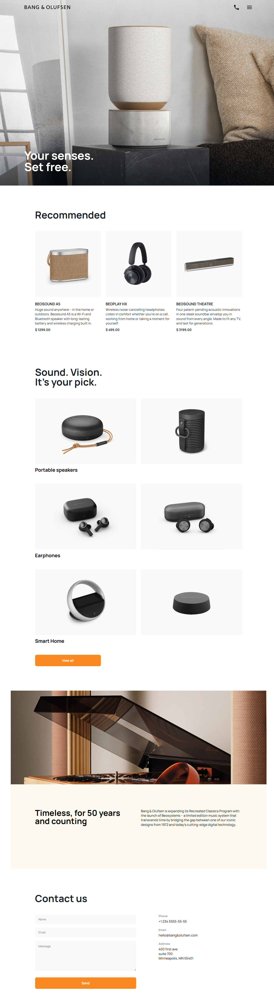

# Bang & Olufsen Landing Page

A responsive landing page for Bang & Olufsen, built as a learning project. The page presents recommended products, product categories, an "About us" section, and a contact form. Fully responsive: mobile, tablet, and desktop.

## Technologies

- HTML5
- SCSS (Sass) — modular structure with `@use`, BEM methodology
- Google Fonts (Manrope, Roboto)
- Live Sass Compiler / npm scripts (build tooling)

## Live preview

[View live demo](https://kacper7-7.github.io/layout_miami/)

## Layout

[Figma design](https://www.figma.com/design/DtkQmQ797hk0nI4KfMi2Uq/BOSE-New-Version?node-id=6817-211&p=f&t=TJNGmX2Jio7zOcr6-0)

## Running locally

```bash
# 1. Clone the repository
git clone https://github.com/kacper7-7/layout_miami.git
cd layout_miami

# 2. Install dependencies
npm install

# 3. Start the SCSS watcher (compiles SCSS to CSS on save)
npm run watch:sass

# 4. Open index.html in your browser
# (recommended: use Live Server extension in VS Code)
```

### Available scripts

- `npm run watch:sass` — watches SCSS files and compiles to CSS
- `npm run build:sass` — single compilation (production)


### Screenshots

